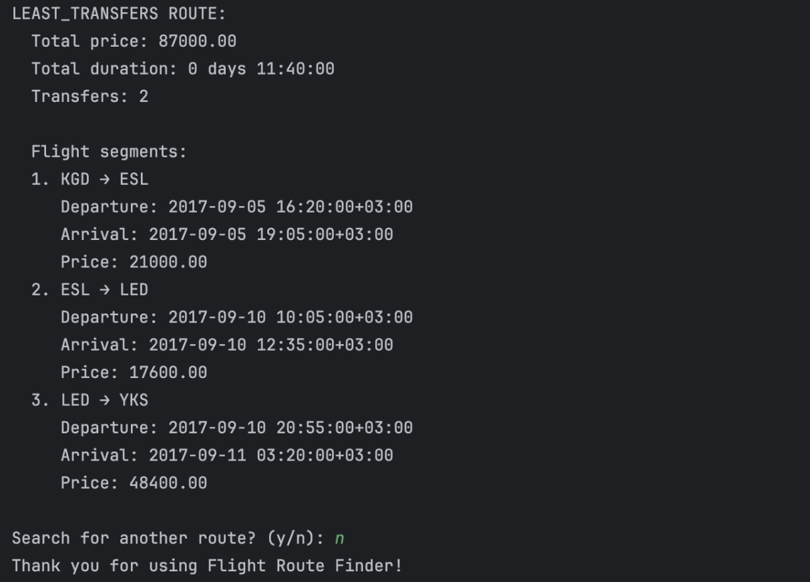

# Flight Route Optimizer
## Team Members
- [Zijing Ye](https://github.com/Yeahzz929)   
- [Yueqi Yan](https://github.com/YueqiYan307)   
## Project Overview
Flight Route Optimizer is a Python CLI tool that loads Russian flight operation and ticket data, builds a route graph, and recommends itineraries ranked by lowest price, fewest transfers, or shortest total duration. 
## Dataset
This project uses flight data from Kaggle: https://www.kaggle.com/datasets/saadharoon27/airlines-dataset/data. 

The dataset is stored as a SQLite database containing 8 tables, covering flight operations within Russia from July 16, 2017 to September 14, 2017, with a total of 61,502 records. The main tables used in this project are:

- flights – flight details

- airports_data – airport information

- ticket_flights – ticket price data
### Visualization
We performed an initial visualization of the flight network:  

- Node size & color: weighted by flight count (yellow = busiest)   
- Highlights hubs (e.g. SVO, DME) with highest connectivity and regional clusters reflecting route density

## Project Structure

```text
flight-route-finder/
├── data/
│   └── processed/
│       └── flight_ticket_summary.csv   # processed dataset summary
├── scripts/
│   └── connect_and_merge_data.py       # data‑merging script
├── src/
│   ├── __init__.py                     # package initialization
│   ├── preprocessing.py                # data preprocessing functions
│   └── flight_functions.py             # flight graph & path search
├── main.py                             # main entrypoint
├── requirements.txt                    # project dependencies
├── README.md                           # project documentation
└── .gitignore                          # Git ignore rules
```

## Process

### Step 1: Data Preprocessing
Use functions in `src/preprocessing.py`:  
1. `extract_city_names(df)` – parse multilingual city names  
2. `extract_coordinates(df)` – parse lat/long from airport data  
3. `process_time_columns(df)` – convert times to datetime, calculate durations  
4. `fill_missing_amount_by_route_type(df)` – impute or drop missing prices  
5. `city_to_airports_map(df)` – build a mapping from city → airport codes  

### Step 2: Build Flight Graph & Search Paths
Use functions in `src/flight_functions.py`:  
1. `build_flight_graph(df, departure_time)` – construct directed multigraph filtered by time  
2. `find_all_paths(G, city_map, origin, destination)` – enumerate valid itineraries respecting layover rules  
3. `get_path_details(G, path)` – compute total price, duration, transfers, validate minimum connect time  
4. `select_best_routes(path_details)` – pick top routes by price, duration, and transfers  

### Step 3: Main Program Flow
In `main.py`:  
1. Parse CLI arguments (data paths, criteria)  
2. Load SQLite or CSV via `connect_and_merge_data.py` → run preprocessing  
3. Enter interactive loop: prompt for origin, destination, departure datetime  
4. Call search module → retrieve optimal routes  
5. Display formatted results to user  
6. Prompt to continue or exit  

## Results
#### 1. User Input
  
*Interactive prompt where the user enters departure city, arrival city, departure date and time.*

---

#### 2. Cheapest Route
  
*Cheapest route showing total price, total duration, number of transfers, and each flight segment’s departure/arrival times and prices.*

---

#### 3. Fastest Route
  
*Fastest route highlighting the shortest total travel time, along with price, transfers count, and detailed segments.*

---

#### 4. Least Transfers Route
  
*Route with the fewest connections, displaying price, duration, and each segment for minimal layovers.*


## Future Enhancements
- Real‑time integration of online flight data and ticket pricing    
- Integrate a graphical user interface or web application to enhance user experience  
- Consider factors such as the user’s journey to the departure airport (e.g., driving time and fuel cost) when recommending optimal routes
- Add timezone conversion support—translate users’ local departure times into a unified UTC baseline for accurate scheduling    
  
